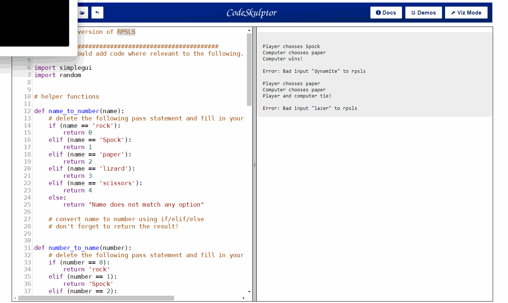

## Rock-paper-scissors-lizard-Spock
Rock-paper-scissors-lizard-Spock (RPSLS) is a variant of Rock-paper-scissors that allows five choices. Each choice wins against two other choices, loses against two other choices and ties against itself

[CodeSkulptor Link to execution](https://py2.codeskulptor.org/#user50_c48Y7wVz1U_0.py)

