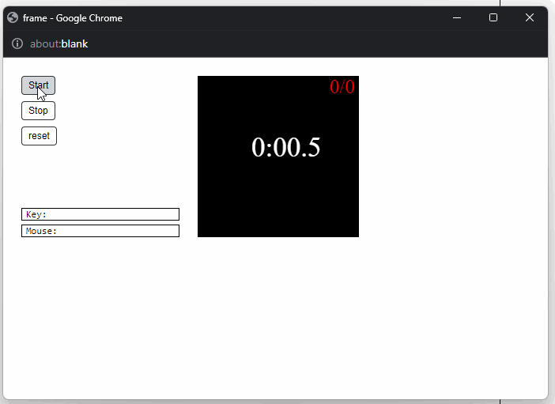

## "Stopwatch: The Game"
combining text drawing in the canvas with timers to build a simple digital stopwatch that keeps track of the time in tenths of a second. The stopwatch should contain "Start", "Stop" and "Reset" buttons

# Learnings
-Create a canvas in Python, learn how to draw on the canvas, create a digital stopwatch

[CodeSkulptor Link to execution](https://py2.codeskulptor.org/#user49_4iJJ2eMZvdbQFwm.py)

